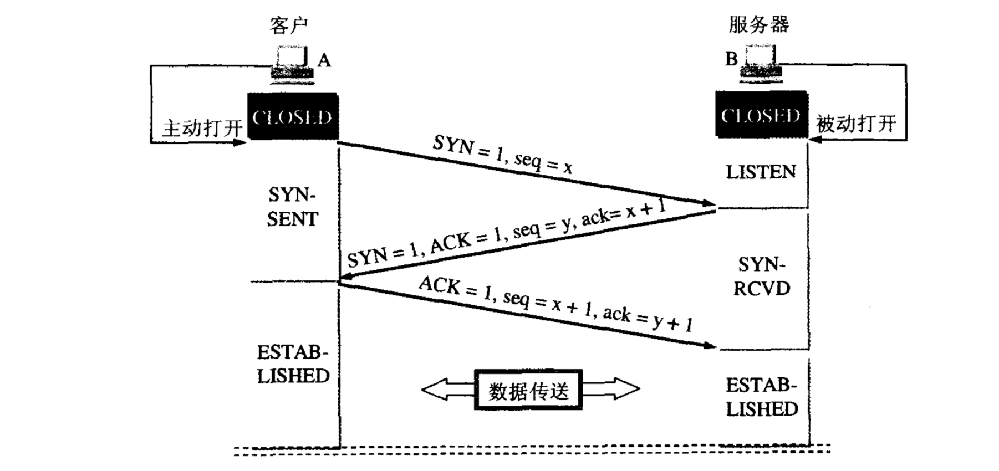
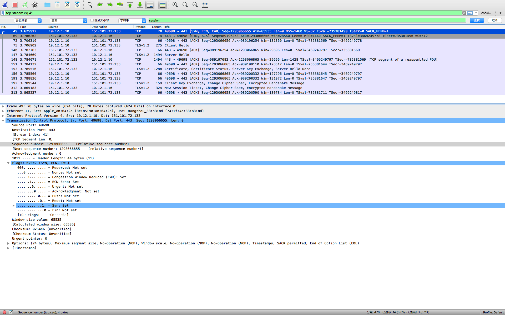

# TCP连接过程（3次握手）

&emsp;&emsp;TCP连接要解决的三个问题：
- 要使通讯的每一方能够感知对方的存在。
- 要允许双方协商一些参数包括：窗口的最大值、能否使用窗口扩大选项和时间戳选项及服务质量等。
- 能够对运输实体资源（如缓存大小、连接表中的项目等）进行分配。

&emsp;&emsp;本文旨在讲述TCP3次握手过程，并不能完全回答以上三个问题，有待系列文章讲述清楚TCP协议后来回答。主动发起连接建立的应用进程称为客户(client)，被动等待连接建立的应用进程称为服务器(sever)。如图1为TCP连接三次握手过程。

&emsp;&emsp;最初客户端和服务的都为关闭状态，图中下面方框分别为TCP进程所处的状态。A主动打开连接，B被动打开连接。B的TCP服务进程创建传输控制块TCB，处于LISTEN(收听)状态，等待客户端连接请求。3次握手过程如下：
1. A的TCP客户进程创建TCB，向B发出连接请求报文段，报文段中首部的同部位SYN = 1(此时ACK = 0)，同时选择一个初始序号seq = x。TCP规定，SYN报文段(SYN = 1的报文段)不能携带数据，但要消耗掉一个序号。客户端进入SYC-SENT(同步已发送)状态。
2. B收到连接请求报文段后，如同意建立连接，向A发送确认。在确认报文段中将SYN和ACK置1， 确认号是ack = x + 1（因为接到的seq为x所以期待下次收到的序号为x + 1），同时自己选择一个初始序号seq = y。该报文段不携带数据但也消耗一个序号。此时服务器进入SYN-RCVD（同步收到)状态。
3. TCP客户端进程收到B的确认后，还要向B给出确认。确认报文段的ACK置1(SYN为0)，确认号ack = y + 1，而自己的序号seq = x + 1。TCP的标准规定，ACK报文段可以携带数据。如果不携带数据则不消耗序号，在这种情况下，下一个数据报文段的序号仍是seq = x + 1。此时，TCP连接建立，A进入ESTABLISHED(已建立连接)状态。B收到A的确认后，也进入ESTABLISHED状态。

&emsp;&emsp;问题1：为什么要进行第三次握手？  
&emsp;&emsp;答：若A第一次发出的连接请求报文段在网络中滞留，因超时导致A重传请求连接，而先前滞留的请求延误到连接释放以后的某个时间才到达B。若不进行第三次握手，那么B收到这个已失效的请求报文段后就误以为A又再次发出新的连接请求，于是向A发出确认报文段同意建立连接，则新的连接就已经建立了，并等待A发送数据，但A并不会理睬B，造成B的许多资源被浪费掉。

&emsp;&emsp;如下图为通过对Wireshark抓包得到的数据进行分析从而更加直观的感受TCP连接的建立过程：

TCP 第1次握手

&emsp;&emsp;如图TCP第1次握手所示，为客户端向服务器发出的请求连接报文段中sqe = 1293066655，ack = 0，SYN = 1，ACK = 0。

TCP 第2次握手

&emsp;&emsp;如图TCP第2次握手所示，为客户端向服务器发出的请求连接报文段中sqe = 989196253，ack = 1293066656（因为要消耗一个序号所以下一个期待收到的序号为收到客户端的seq + 1），SYN = 1，ACK = 1。

TCP 第3次握手

&emsp;&emsp;如图TCP第3次握手所示，为客户端向服务器发出的请求连接报文段中sqe = 1293066656（与第二次握手收到的ack值一致，即发出服务器端期待的序号，同时这个序号是第3次握手发出的序号，如果第3次握手不携带数据那么不消耗序号，即第3次握手后客户端在下一次向服务器发送TCP报文段时将再次使用该序号），ack = 989196254（因为要消耗一个序号所以下一个期待收到的序号为收到服务器的seq + 1），SYN = 1，ACK = 0。

(完)

#### 参考文献

- 谢希仁.计算机网络(第5版)
